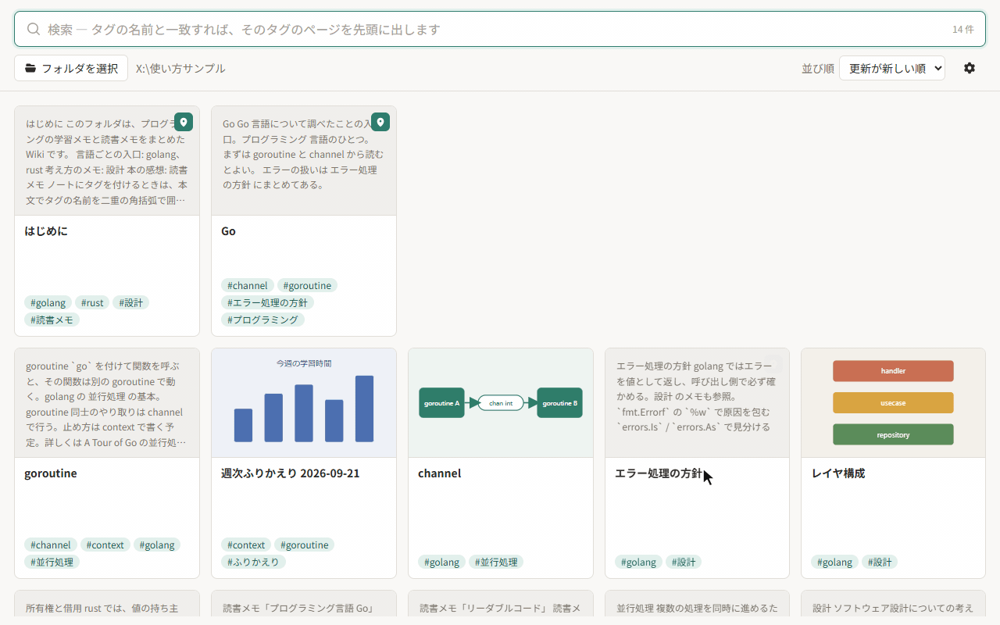

# taggo

Markdown を使った、タグ管理のローカル Wiki デスクトップアプリです（Windows 専用）。
好きなエディタで書いた Markdown のフォルダを開くと、タグとリンクでたどれる Wiki として読めます。



## 概要

- **Markdown のノートだけを扱うローカル Wiki**
  - 開いたフォルダの直下にある Markdown を、1 枚ずつのカードとしてフラットに並べて表示します。サブフォルダの中は読みません。
  - 本文で画像や YouTube 動画を使っているノートは、最初の画像または動画のサムネイルをカードに表示します。
  - よく使うノートは、一覧の先頭にピン留めできます。
  - キーワードで検索し、タグとノート同士のリンク、関連ページでたどれます。
- **ファイル名がタグになる**
  - ノートのファイル名（拡張子を除く）が、そのままタグを表します。`golang.md` は `golang` タグのページです。
  - ノートにタグを付けるには、本文に `[[タグ]]` と書きます。Front Matter は使いません。
- **タグはノート自身が持つ**
  - taggo は独自のデータベースを持ちません。ノート自身に書かれたタグを唯一の正の情報として扱います。
  - taggo を使わなくなってもタグはノートと一緒に残り、他のツールからも読めます。

## ノート

- 本文の `[[タグ]]` で複数タグ指定可能
- ファイル名がタグを表す（`タグ.md` がそのタグのページ）
- GFM・コードハイライト・mermaid サポート
- `[[タグ]]` と Markdown 同士のリンクをたどる移動（まだ無いページもファイルを作らずに開ける）。外部リンクは下線と「↗」で見分けて、既定のブラウザで開く
- プレビューの下端に本文の文字数を表示
- 本文の下に、タグごと（そのタグのページと、そのタグを持つノート）にまとめた関連ページをグリッド表示
- 一覧の先頭へのピン留め（フォルダ直下の `.taggo.json` に保存）
- URL だけを書いた段落のリンクカード表示（YouTube・X 対応）
- 本文の埋め込み画像をクリックすると画像ビューアを開く。拡大縮小、全体表示、原寸表示
- md 拡張子に紐づいたエディタで開くボタン（保存した変更は自動で反映）

## あえてしないこと

- **ノートを書き換えない。** 本文の編集やタグの編集、画像の加工はせず、既存のノートには一切書き込みません。ノートもタグも好きなエディタで書き、taggo はその変更を拾います。新しくファイルを作るのは、まだ無いページで「md ファイルを作成する」を押したときと、検索結果の上の「`タグ.md` を作成する」を押したときだけです（見出しだけのファイルを作ってエディタへ渡します）。ノート以外に書き込むのは、ピン留めを残すフォルダ直下の `.taggo.json` だけです。
- **フォルダの階層を持たない。** 読むのは開いたフォルダの直下だけです。ファイル名がタグを表すので、同じ名前のノートがフォルダ違いで並ばないようにしています。

## 使い方

[docs/使い方.md](docs/使い方.md) にまとめています。

---

## 機能一覧

### ファイル名がタグ

ノートのファイル名（拡張子を除く）が、そのままタグを表します。`golang.md` は `golang` タグのページで、そのタグが何を表すのかを書いておく場所になります。

- タグの大文字小文字と、空白の連なりは区別しません（`Golang.md` も `golang` タグのページです）。
- `/` や `?` など、Windows のファイル名に使えない文字を含むタグには、ページを作れません。

### ノートにタグを付ける

本文に `[[タグ]]` と書くと、そのノートにタグが付きます。1 つのノートに複数のタグを付けられます。

```markdown
# Go の並行処理

[[golang]] の [[並行処理]] について調べたこと。
```

- 上のノートには `golang` と `並行処理` の 2 つのタグが付きます。
- 本文の `[[タグ]]` は、プレビューではそのタグのページへのリンクになります。ページがまだ無ければ赤みがかった色で示します。
- コードブロックとインラインコードの中の `[[ ]]` はタグとして読みません。
- タグを付け外しするには、エディタで本文を直します。taggo にはタグを編集する機能はありません。
- Front Matter（先頭の `---` で囲んだ YAML）は使いません。`tags:` を書いてもタグにはなりません。ほかのツールで書いたノートの Front Matter は、プレビューと抜粋からは外して表示します。

### 検索

検索バーに入力した文字で、1 文字ごとに絞り込みます。

- 空白で区切った語を、すべて含むノートが結果になります。語はタイトル・ファイル名・本文の抜粋・タグから探します。大文字小文字は区別しません。
- 入力した文字がタグの名前と一致するときは、そのタグのページを結果の先頭に出します。その後ろに、そのタグを付けたノートなどの検索結果が並びます。
- そのタグのページがまだ無いときは、結果の上に「`タグ.md` を作成する」ボタンを出します。押すと、まだ無いページの「md ファイルを作成する」と同じく、見出しだけのファイルを作ってエディタで開きます。ファイル名に使えない文字を含む入力では出しません。
- カードのタグバッジをクリックすると、そのタグで検索します。

### ピン留め

カードの右上か、プレビューのヘッダーの「ピン留め」で、ノートを一覧の先頭にピン留めできます。

- ピン留めしたノートは、検索していないときの一覧の先頭に、ピン留めした順で並びます。残りのノートは次の行から並びます。
- ピン留めは、開いたフォルダの直下の `.taggo.json` に保存します。ノートと一緒に同期・バックアップされます。

```json
{
  "pinned": [
    "はじめに.md",
    "golang.md"
  ]
}
```

- 手で書き換えてもかまいません。並べ替えたい場合は、この順番を入れ替えます。taggo の知らない項目は、書き込むときも残します。

### 関連ページ

本文の下に、関連ページをグループに分けてカードのグリッドで並べます。

- **リンク元のグループ**：一番上に、このノートを指しているノートを並べます。このノートが表すタグ（`golang.md` なら `golang`）を持つノートと、Markdown のリンクでこのノートへリンクしているノートです。
- **タグのグループ**：ノートに付いているタグごとに、「そのタグのページ」を先頭に、「そのタグを持つノート」を後ろに並べます。
- **リンク先のグループ**：最後に、このノートが Markdown のリンクでリンクしているノートを並べます。
- どのグループでも、開いているノートと同じタグを多く持つノートほど先に来ます（リンク先のグループは本文でリンクしている順）。
- 前のグループに出したノートは、後のグループには出しません。
- 1 つのグループに並べるのは 24 件までです。それを超える分は「ほか N 件」と出し、タグのグループではクリックでそのタグの検索に移ります。
- グループの見出しの `#タグ` をクリックすると、そのタグで検索します。
- ページの無いタグや、行き先の無いリンクは「まだ無いノート」として点線のカードで出ます。

### まだ無いノート

まだ書いていないノートへのリンクと、ページの無いタグは「まだ無いノート」として関連ページに点線で出て、本文中では赤みがかった色になります。

- クリックすると、ファイルは作らずに、そのページをプレビューで開きます。本文の代わりに「md ファイルを作成する」ボタンが出て、その下に関連ページ（そのページを指しているノートなど）が並びます。
- 「md ファイルを作成する」を押すと、見出しだけの Markdown ファイルを作って既定のエディタで開きます。作ったファイルはすぐに一覧に載り、開いているページも本文の表示に切り替わります。
- 作る場所は開いたフォルダの直下に限ります。リンクがサブフォルダやフォルダの外を指しているときは開けません。
- タグのページは `タグ.md` という名前で作ります。

### 画像埋め込み

```markdown

```

- 相対パスは Markdown ファイルの位置を基準に、`/` 始まりは開いているフォルダを基準に解決します。
- 表示できるのは、開いているフォルダ配下にある JPEG・PNG・GIF・WebP・AVIF・BMP・SVG です。

### Youtube や X のリンクカード

Markdown の本文に URL だけを 1 行で書くと、プレビューではリンク先のタイトル・説明・画像を載せたカードになります。

```markdown
https://www.youtube.com/watch?v=xxxxxxxxxxx
```

- 文中のリンクや、`[名前](https://…)` のように表示名を付けたリンクはカードにしません。
- 一般のページは OGP を、YouTube と X（投稿の URL）はそれぞれの oEmbed を読みます。X の投稿は画像を出さず、本文だけを表示します。

### ユーザ設定

設定は `%APPDATA%\taggo\settings.json` に保存します。

- 起動時に開くフォルダ（開かない・前回開いたフォルダ・指定したフォルダ）
- 一覧の既定の並び順（ツールバーで切り替えた並び順は保存しません）
- 1 回の走査の上限件数（デフォルト 20,000 件。1,000〜10 万件。次にフォルダを開いたときと、続きを読み込むときから反映）
- テーマ（OS に合わせる・ライト・ダーク）

### クラウド同期フォルダを開くとき

Windows の Cloud Files API を使う同期サービス（Dropbox や OneDrive）であれば、次のように振る舞ってダウンロードを起こしません。

- フォルダ走査そのものはファイルを開きません（ディレクトリの列挙だけで済ませます）。
- 中身がクラウド上にしか無いファイルは、ファイル属性（`RECALL_ON_DATA_ACCESS` など）から見分けて**一度も開きません**。ディレクトリの列挙で分かる名前と更新日時だけで一覧に出し、カードに「クラウド上のみ」と表示します。本文を読まないのでタグや本文の語では見つかりませんが、ファイル名では検索できます。
- そうしたファイルにはプレビューを要求しません。
- `.taggo.json` の中身がクラウド上にしか無いときは、ピン留めを読み込みません（書き込みも断ります）。
- 本文に埋め込んだ画像の中身がクラウド上にしか無いときは、その画像を表示しません。ノートを開いただけでダウンロードが始まらないようにするためです。
- 詳細プレビューの「ダウンロードして読み込む」を押したときだけ、そのファイルを読み込みます。
- 読み込んだあとで同期サービスが「オンラインのみ」へ戻したファイルも、開く直前に属性を確かめ直して見分けます。
