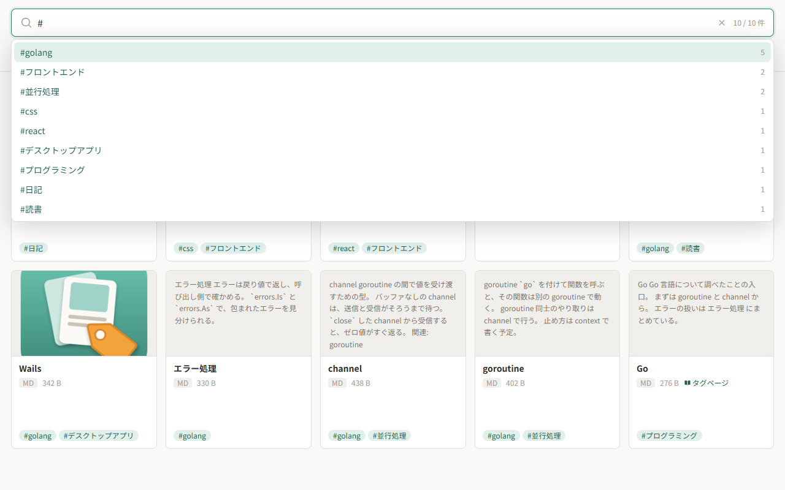
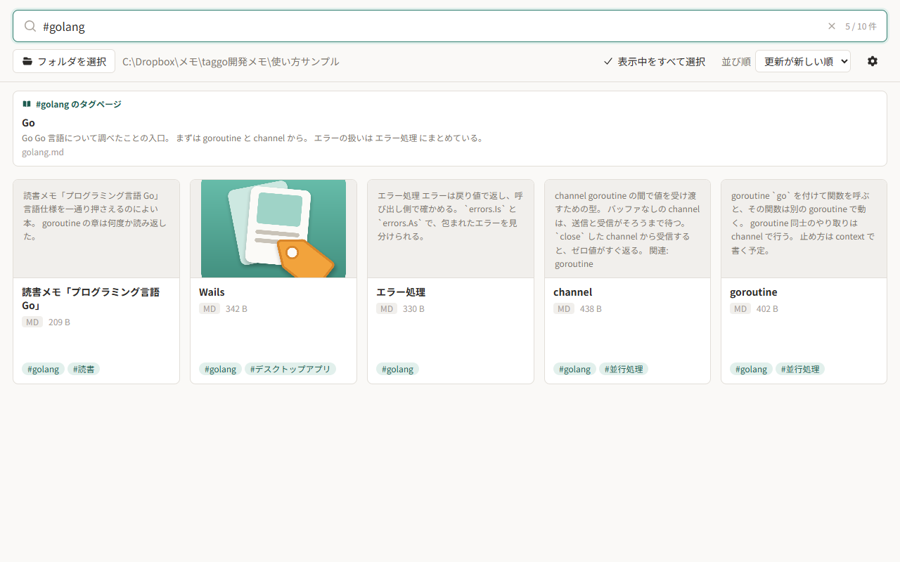
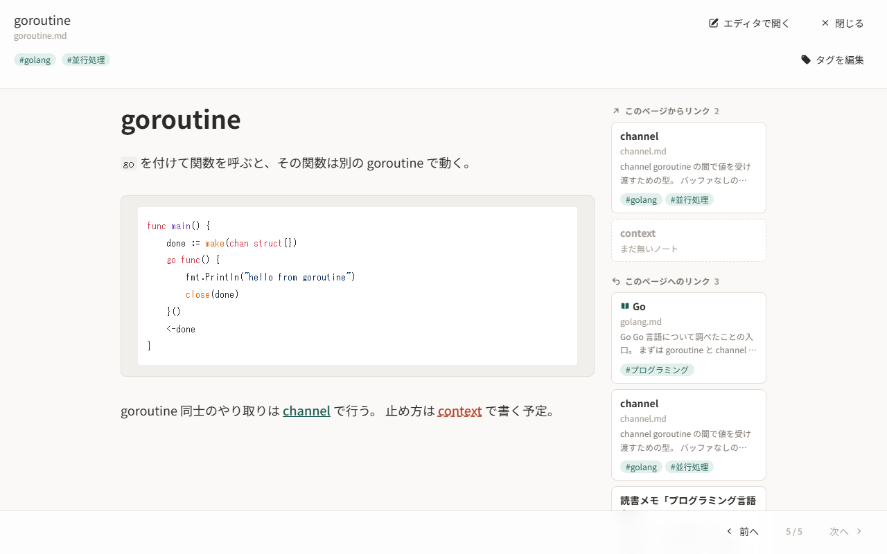
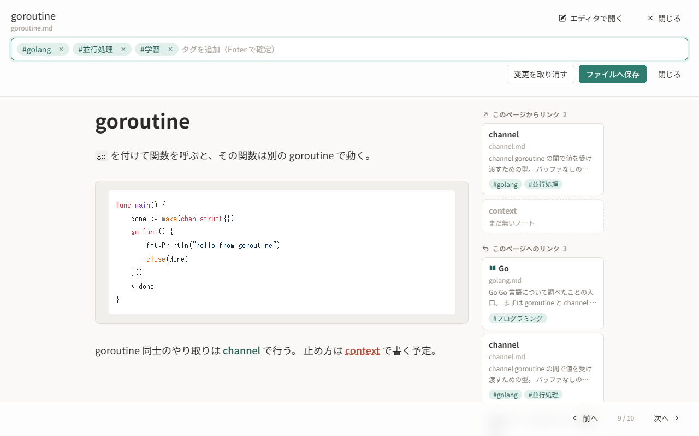
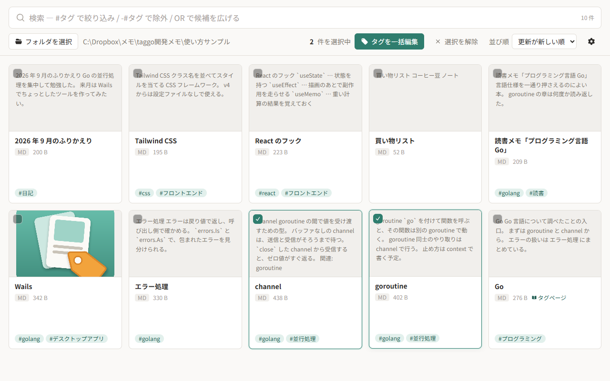
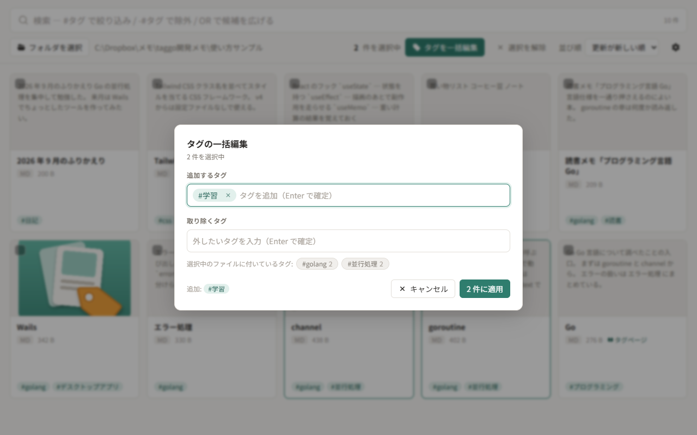
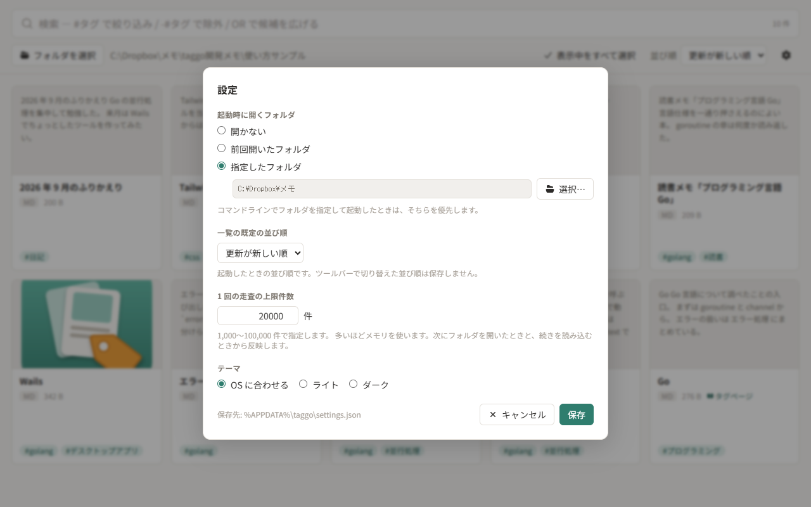

# taggo の使い方

taggo は、フォルダ内の Markdown をカードで並べて、タグとリンクでたどれるようにするアプリです。
ここでは基本的な操作を画面の画像付きで紹介します。細かい仕様は [README](../README.md) を参照してください。

## 1. フォルダを開く

ツールバーの「フォルダを選択」から、Markdown の入ったフォルダを選びます。
配下の Markdown が、サブフォルダも含めて 1 枚ずつのカードとして並びます。


- カードには本文の抜粋と、Front Matter に書いたタグが出ます。
- 本文に画像や YouTube 動画があるノートは、最初の 1 つをサムネイルとして表示します。
- 右上の「並び順」で、更新が新しい順・名前順などに切り替えられます。

## 2. 検索する

最上部の検索バーに入力すると、1 文字ごとに絞り込みます。
`#` を入力すると、登録済みのタグが使われている件数の多い順に出ます。



`#タグ` で検索すると、そのタグを持つノートだけになります。
そのタグの「タグページ」（後述）があるときは、一覧の上に見出しとして出ます。



| 書き方      | 意味                                           |
| ----------- | ---------------------------------------------- |
| `#タグ`     | そのタグを持つもの                             |
| `-#タグ`    | そのタグを持たないもの                         |
| `#a OR #b`  | どちらかのタグを持つもの                       |
| `語`        | タイトル・ファイル名・本文・タグへの部分一致   |
| `"複数 語"` | 空白を含めて 1 語として扱う                    |

カードの `#タグ` バッジをクリックしても、そのタグで絞り込めます。

## 3. ノートを読む

カードをクリックすると、Markdown のプレビューが開きます。



- 本文の右に関連ページが並びます。上が「このページからリンク」、下が「このページへのリンク」です。クリックするとそのノートへ移ります。
- まだ書いていないノートへのリンクは「まだ無いノート」として点線で出ます（本文中では赤みがかった色）。クリックすると、そのファイルを作って既定のエディタで開きます。
- 「エディタで開く」で、拡張子に紐づいたエディタが開きます。保存した変更は自動でプレビューに反映されます。
- 下端の「前へ」「次へ」で、一覧の並びどおりに隣のノートへ移れます。`Esc` か「閉じる」で一覧に戻ります。

taggo 自身は本文を編集しません。本文は好きなエディタで書いてください。

## 4. タグを付ける

プレビューの「タグを編集」を押すと、タグの入力欄になります。
タグを入力して `Enter` で確定し、「ファイルへ保存」で Markdown の Front Matter へ書き込みます。



保存すると、ファイルの先頭に次のように書かれます。

```markdown
---
tags:
  - golang
  - 並行処理
  - 学習
---
```

## 5. まとめてタグを付け替える

`Ctrl` を押しながらカードをクリックする（またはカード左上のチェックを押す）と、複数のノートを選べます。
選ぶとツールバーに「タグを一括編集」が出ます。



「追加するタグ」と「取り除くタグ」を別々に指定して、選んだノートへまとめて適用できます。



## 6. タグページを作る

Front Matter に `tag:` を書いた Markdown は、そのタグを説明する「タグページ」になります。
taggo からは作らないので、好きなエディタで書いて置いてください。

```markdown
---
tag: golang
tags:
  - プログラミング
---

# Go

Go 言語について調べたことの入口。
```

`#golang` で検索すると、このノートが一覧の上に見出しとして出ます（[2. 検索する](#2-検索する) の画像を参照）。

## 7. 設定

ツールバー右端の歯車ボタンから開きます。



- 起動時に開くフォルダ（開かない・前回開いたフォルダ・指定したフォルダ）
- 一覧の既定の並び順
- 1 回の走査の上限件数
- テーマ（OS に合わせる・ライト・ダーク）

設定は `%APPDATA%\taggo\settings.json` に保存されます。ノートのタグや内容は保存しません。
