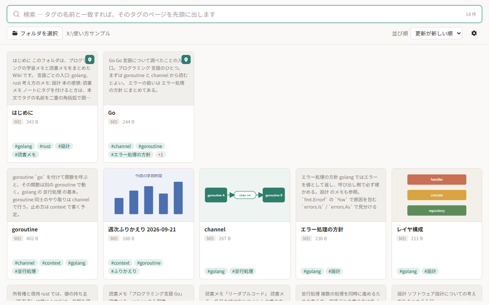
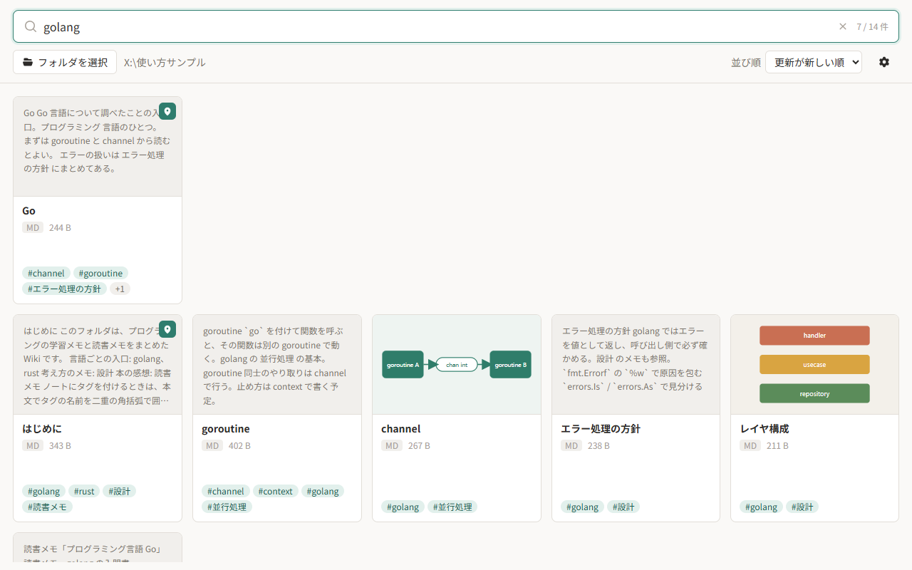
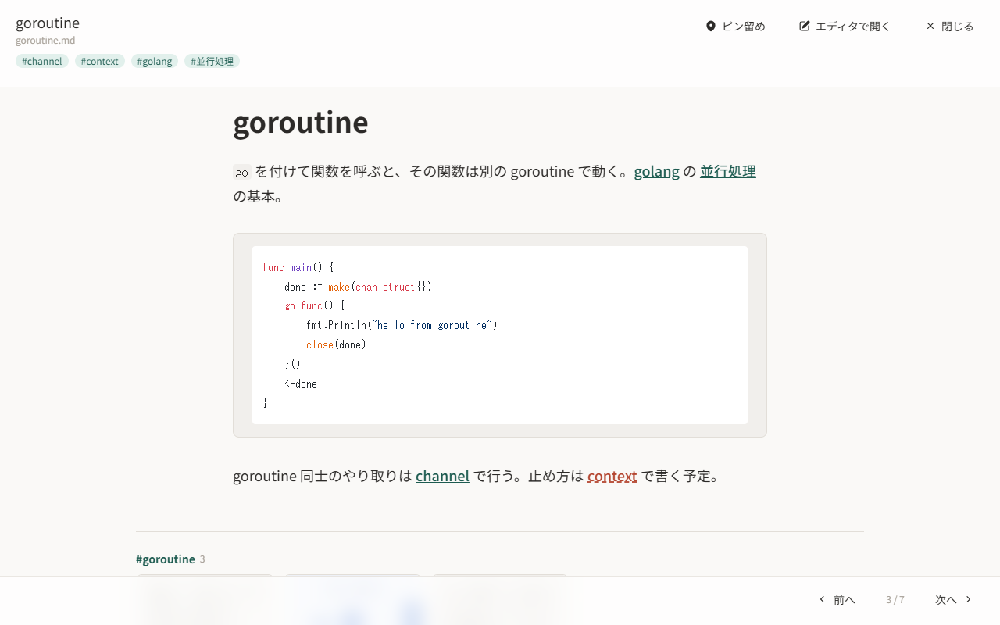
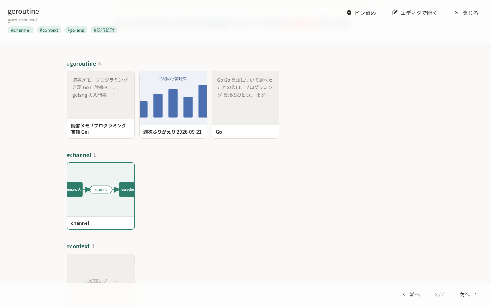
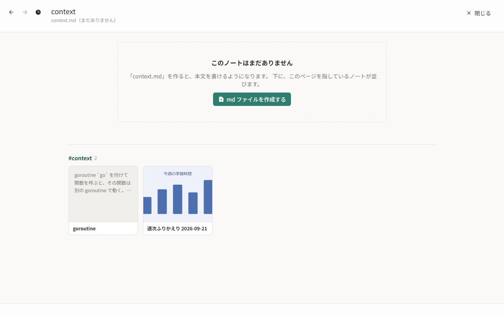
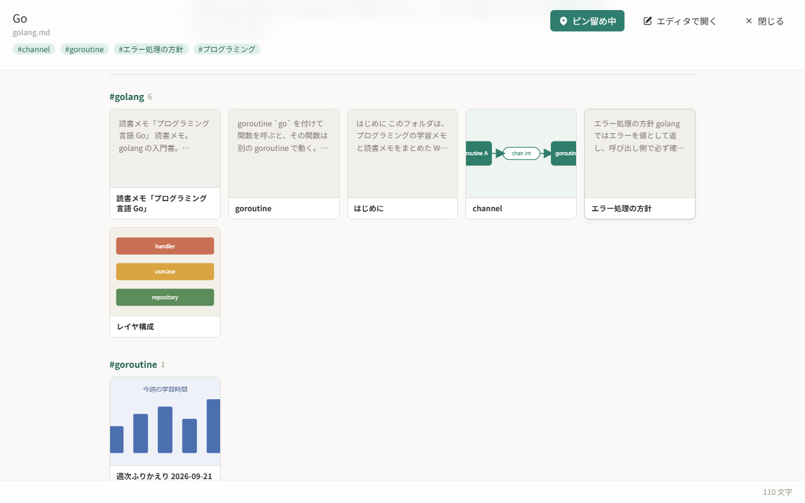
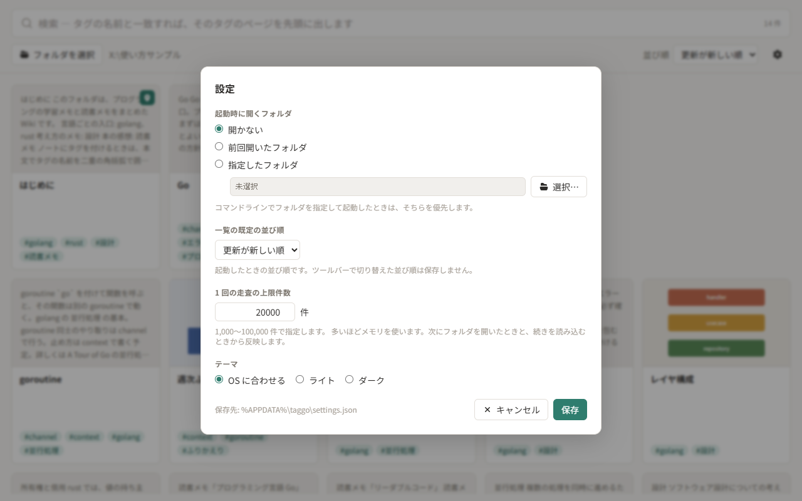

# taggo の使い方

taggo は、フォルダ内の Markdown をカードで並べて、タグとリンクでたどれるようにするアプリです。
ここでは基本的な操作を画面の画像付きで紹介します。細かい仕様は [README](../README.md) を参照してください。

## 1. フォルダを開く

ツールバーの「フォルダを選択」から、Markdown の入ったフォルダを選びます。
フォルダの直下にある Markdown が、1 枚ずつのカードとして並びます。サブフォルダの中は読みません。



- カードには本文の抜粋、タイトル、ノートに付けたタグ（4 行まで）が出ます。タグ欄に収まらない分は「+1」のように数で示し、タグ欄に乗ると全部を表示します。
- 本文に画像や YouTube 動画があるノートは、最初の 1 つをサムネイルとして表示します。
- ピン留めしたノート（後述）は、一覧の先頭の行に並びます。
- 右上の「並び順」で、更新が新しい順・名前順などに切り替えられます。

## 2. 検索する

最上部の検索バーに入力すると、1 文字ごとに絞り込みます。

- 空白で区切った語を、すべて含むノートが残ります。語はタイトル・ファイル名・本文の抜粋・タグから探します。
- 入力した文字がタグの名前と一致するときは、そのタグのページ（後述）が一覧の先頭に出ます。その後ろに、そのタグを付けたノートなどが並びます。
- そのタグのページがまだ無いときは、一覧の上に「`golang.md` を作成する」のようなボタンが出ます。押すと、フォルダの直下にそのファイルを作ってエディタで開きます。
- カードの `#タグ` バッジをクリックすると、そのタグで検索します。



## 3. ノートを読む

カードをクリックすると、Markdown のプレビューが開きます。



- 本文の `[[タグ]]` はリンクになっていて、クリックするとそのタグのページを開きます。ページがまだ無いものは赤みがかった色で出ます。
- 「エディタで開く」で、拡張子に紐づいたエディタが開きます。保存した変更は自動でプレビューに反映されます。
- リンクをたどると左上に「←」「→」が出て、たどる前のノートへ戻れます（`Alt` + 左右キーやマウスの戻る・進むボタンでも動きます）。
- 下端には本文の文字数（改行を除く）が出ます。
- `Esc` か「閉じる」で一覧に戻ります。

本文の下には、関連ページがカードで並びます。



- 一番上がこのノートを指しているノート（リンク元）です。続いてタグごとに「そのタグのページ」と「そのタグを持つノート」がまとまり、最後にこのノートからのリンク先が並びます。
- 前のグループに出たノートは、後のグループには出ません。
- クリックするとそのノートへ移ります。グループの見出しの `#タグ` をクリックすると、そのタグで検索します。

まだ書いていないノートへのリンクや、ページの無いタグは「まだ無いノート」として点線で出ます。
クリックすると、ファイルは作らずにそのページを開き、そのページを指しているノートが下に並びます。



「md ファイルを作成する」を押すと、見出しだけのファイルを作って既定のエディタで開きます。作ったファイルが読み込まれると、ページは本文の表示に切り替わります。

taggo 自身はノートを書き換えません。本文もタグも、好きなエディタで書いてください。

## 4. タグを付ける

エディタで本文に `[[タグ]]` と書くと、そのノートにタグが付きます。

```markdown
# Go の並行処理

[[golang]] の [[並行処理]] について調べたこと。
```

- 保存すると、taggo の一覧とプレビューにすぐ反映されます。
- タグを外すときは、本文から `[[タグ]]` を消します。taggo にはタグを編集する機能はありません。
- Front Matter の `tags:` はタグになりません。

## 5. タグのページを書く

ノートのファイル名が、そのままタグを表します。`golang.md` は `golang` タグのページです。
そのタグが何を表すのか、どこから読み始めるとよいのかなどを書いておく入口に使えます。

```markdown
# Go

Go 言語について調べたことの入口。書き方の方針は [[コーディング規約]] を参照。
```

- `golang` と検索すると、このノートが一覧の先頭に出ます。
- このノートの関連ページでは、`golang` タグを付けたノートが最初のグループに並びます。



- 本文の `[[golang]]` からたどると、まだ `golang.md` が無ければ「まだ無いページ」として開きます。「md ファイルを作成する」を押すと、フォルダの直下に `golang.md` を作ってエディタで開きます。

## 6. ピン留めする

よく開くノートは、一覧の先頭にピン留めできます。
カードに乗ったときに右上に出るピンか、プレビューのヘッダーの「ピン留め」を押します。

- ピン留めしたノートは、検索していないときの一覧の先頭に、ピン留めした順で並びます。
- ピン留めは、開いたフォルダの直下の `.taggo.json` に保存されます。並べ替えたいときは、このファイルの順番を書き換えます。

## 7. 設定

ツールバー右端の歯車ボタンから開きます。



- 起動時に開くフォルダ（開かない・前回開いたフォルダ・指定したフォルダ）
- 一覧の既定の並び順
- 1 回の走査の上限件数
- テーマ（OS に合わせる・ライト・ダーク）

設定は `%APPDATA%\taggo\settings.json` に保存されます。ノートのタグや内容、ピン留めは保存しません。
